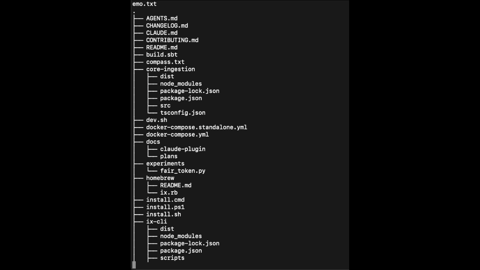
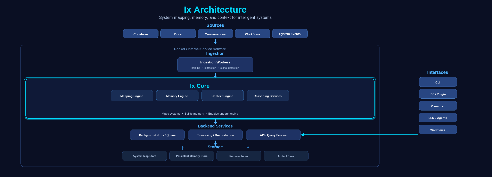

<p align="center">
  
</p>

<h1 align="center">Understand any codebase instantly.</h1>
<p align="center"><em>Your context saver and virtual cartographer.</em></p>

<p align="center">
  
  
  
  
</p>

<p align="center">
  
  
  
  
</p>

<p align="center">
  <a href="https://www.ix-infra.com">Website</a> ·
  <a href="https://www.ix-infra.com/docs">Docs</a> ·
  <a href="https://www.ix-compass.com/">Demo</a>
</p>

<p align="center">
  ⭐ Star this repo if you find it useful
</p>

<br/>

---

<br/>

## Problem
Running out of tokens while developing?
Not anymore...


Software systems are too complex to understand.

You read code.
You search logs.
You still guess.

Ix maps your system instead.

AI can’t reason about systems.
LLMs can’t remember them either.

Ix fixes both.

## Demo

<p align="center">
  
</p>

Stop digging through files.
Open the map instead.

Ix improves how AI systems reason about your codebase.

## Results

**30% fewer tokens** on development tasks  
**43% increase in daily LLM usage**  
**Understand systems in minutes, not hours**

Directed context. More signal. Persistent system memory.

## Install

```bash
curl -fsSL https://ix-infra.com/install.sh | sh
```

## Requirements

- macOS, Linux, or Windows
- Git installed
- Docker (for full functionality)

## Supported Languages

Ix currently supports:

- TypeScript / JavaScript
- Python
- Go
- Java
- more coming

(See docs for full list)

## Quick Start

Map your system:

```bash
ix map .
```

Understand a component:

```bash
ix explain auth-service
```

Trace a flow:

```bash
ix trace user_login_flow
```

Analyze impact:

```bash
ix impact database.schema
```

Stop guessing. Start navigating.

Map → Explain → Trace → Impact

## Why Ix

Modern systems are not just complex — they're constantly changing.

Every time you switch context, onboard to a new service, or debug a flow, you start from zero.

- knowledge is fragmented across code, logs, and people
- context is lost between sessions
- understanding does not persist

AI doesn’t solve this.
It amplifies it — reasoning is limited to the current prompt, and memory disappears between interactions.

Ix is built to fix this at the system level.

- builds a structured map of your system
- captures relationships and flows
- persists understanding over time
- gives both humans and AI a shared source of truth

Stop re-learning your system.
Start navigating it.

## Use Cases

Ix is most useful for:

- large codebases
- unfamiliar systems
- onboarding new engineers
- debugging complex flows
- improving LLM-assisted development

## The Shift

Ix turns your system into a living map.

Not static diagrams.
Not outdated docs.

A map you can explore.
A map you can trace.
A map that evolves with your system.

With Ix you can:

- Understand architecture instantly
- Trace how anything works
- See impact before making changes
- Debug systems faster
- Build persistent system memory over time

## Built for humans and AI

Developers use Ix to explore and understand systems.

LLMs use Ix as persistent system memory.

Instead of guessing from limited context,
AI can navigate a real system map — with structure, history, and relationships.

The result:

- better reasoning
- more consistent answers
- understanding that compounds over time

## Architecture
<p align="center">
  
</p>

**How it works:**

1. **Map** — build a system map from code and signals  
2. **Structure** — identify boundaries, flows, and relationships  
3. **Remember** — persist decisions and system knowledge  
4. **Understand** — explore, trace, and analyze with context  

## Core Capabilities

**A living system map**  
Your architecture, always up to date.

**Trace flows instantly**  
Follow how anything moves through your system.

**Understand impact**  
See what changes affect before you make them.

**Persistent system memory**  
Knowledge builds over time.

**AI-assisted reasoning**  
Explore systems with both humans and AI.

## Philosophy

Every complex system should have a map.

Ix gives you yours.

LLMs process. Ix remembers.

Early stage. Rapidly evolving.

If you're building complex systems — we'd love your feedback.

## Contributing

We welcome contributions.

If you’re building with Ix or want to improve it:

- open an issue
- submit a PR
- share feedback

Early stage. Moving fast.

## Claude Code Plugin

A Claude Code plugin that makes Claude always use Ix for codebase understanding — injecting session context on every prompt, intercepting all searches and file reads with graph-aware queries, and keeping the Ix graph current as Claude edits.

### Installation

```
/plugin marketplace add ix-infrastructure/ix-claude-plugin
/plugin install ix-memory
```

Restart Claude Code after installing.

### Requirements

- Ix installed and running (`ix status` returns ok)
- `jq` in PATH
- `ripgrep` (`rg`) in PATH

```bash
# Ubuntu/Debian
sudo apt install jq ripgrep

# macOS
brew install jq ripgrep
```

**Ix Pro** is optional. All skills and hooks work with basic ix. If ix pro is installed, the session briefing hook (`ix-briefing.sh`) will additionally inject goals, bugs, and decisions at the start of each prompt.

### Automatic Hooks

| Trigger | Hook | Effect |
|---------|------|--------|
| User sends any prompt | `UserPromptSubmit` → `ix-briefing.sh` | Injects session briefing (goals, bugs, decisions) once per 10 min — **requires ix pro** |
| Claude runs `Grep` or `Glob` | `PreToolUse` → `ix-intercept.sh` | Front-runs with `ix text` + `ix locate`/`ix inventory` |
| Claude runs `Read` | `PreToolUse` → `ix-read.sh` | Front-runs with `ix inventory` + `ix overview` for the file |
| Claude runs `Bash` with grep/rg | `PreToolUse` → `ix-bash.sh` | Extracts pattern, front-runs with `ix text` + `ix locate` |
| Claude edits a file | `PostToolUse` → `ix-ingest.sh` (async) | Runs `ix map <file>` to update the graph for the changed file |
| Claude finishes responding | `Stop` → `ix-map.sh` (async) | Runs `ix map` to refresh the full architectural graph |

All hooks bail silently if `ix` is not in PATH or the backend is unreachable.

### Skills (slash commands)

| Command | Description |
|---------|-------------|
| `/ix-search <term>` | Graph-aware search combining `ix text` + `ix locate` |
| `/ix-explain <symbol>` | Explain what a symbol does using `ix explain` |
| `/ix-impact <target>` | Analyze blast radius of changing a symbol or file |
| `/ix-trace <symbol>` | Trace the execution flow or call chain for a symbol |
| `/ix-smells [path]` | Detect code smells and structural issues |
| `/ix-understand [target]` | Full architectural overview of a subsystem, module, or the whole repo |
| `/ix-investigate <symbol>` | Deep investigation chaining explain → trace → depends → callers → impact |
| `/ix-depends <symbol>` | Show the full upstream dependency tree |
| `/ix-diff <fromRev> <toRev>` | Show structural changes between two graph revisions |
| `/ix-plan <symbol> [...]` | Risk-annotated change plan for multi-file implementations |
| `/ix-before-edit <target>` | Pre-edit safety check — impact + callers + overview |
| `/ix-read <symbol>` | Read just a symbol's source (resolves to exact file:lines) |
| `/ix-subsystems [target]` | Explore the architectural map — systems, subsystems, cohesion metrics |

All skills fall back gracefully when ix is unavailable — using Grep, Glob, and Read tools instead where possible.

### Agent

The `ix-explorer` sub-agent is available for deep codebase exploration tasks. Claude will automatically delegate to it when exploring unfamiliar code, tracing data flows, or assessing change impact. It uses ix commands exclusively before falling back to native tools.

### Uninstall

```
/plugin uninstall ix-memory
```

See the [ix-claude-plugin repo](https://github.com/ix-infrastructure/ix-claude-plugin) for full details.

## Status

Ix is in early development (alpha).

APIs and behavior may change.
