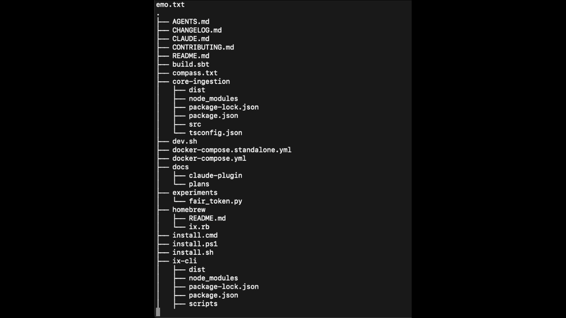

<p align="center">
  
</p>

<h1 align="center">Understand any codebase instantly.</h1>
<p align="center"><em>Your context saver and virtual cartographer.</em></p>

<p align="center">
  
  
  
  
</p>

<p align="center">
  
  
  
  
</p>

<p align="center">
  <a href="https://www.ix-infra.com">Website</a> ·
  <a href="https://www.ix-infra.com/docs">Docs</a> ·
  <a href="https://compass.ix-infra.com">Demo</a> .
  <a href="https://discord.gg/ncEYVHVqZ8">Discord</a>
</p>

<p align="center">
  ⭐ Star this repo if you find it useful
</p>

<br/>

## What Ix is

**Ix is a command-line tool that turns a codebase into a queryable map.**

It parses your repository with [tree-sitter](https://tree-sitter.github.io/) across 26
languages and builds a graph of the symbols, calls and imports it finds, stored in a
local backend (ArangoDB, run for you via Docker). You and your AI assistant then ask
bounded, structural questions instead of grepping and guessing:

```bash
ix map .                      # build the graph for this repo
ix explain IngestionService   # what is this, and what does it touch?
ix impact verify_token        # what breaks if I change this?
ix trace user_login_flow      # how does this actually flow?
```

The graph lives on your machine, and it persists — so context survives between
sessions, and your assistant can navigate a real map of your system instead of
re-deriving it from whatever fits in a prompt.

## Sign up for Kartr

We built Kartr on top of this technology.

An agentic platform where AI agents with persistent memory work alongside you, at your job and in your day to day life.

Kartr aggregates your knowledge from every source you already use:

- your code and systems
- your docs and files
- your email and calendar
- your meetings and notes
- your team chat

One memory, built from all of it, that your agents can reason over.

Agents that remember.
Agents that carry context across sources and sessions.
Agents that get more useful the longer you use them.

Kartr is in alpha. We're onboarding early users now.

<p align="center">
  <a href="https://docs.google.com/forms/d/e/1FAIpQLSdh5IXVGW9mNBUtyBAsP_uysS38GgilpTNMbKRAVQf1FZ1eBg/viewform?usp=pp_url&amp;entry.2087374943=ix_github" target="_blank" rel="noopener noreferrer">
    
  </a>
</p>

## Problem
Running out of tokens while developing?
Not anymore...


Modern software is complicated.

You read code.
You search logs.
You still guess.

AI can’t reason about systems.
LLMs can’t remember them either.

Ix fixes both.

## Demo

<p align="center">
  
</p>

Stop digging through files.
Open the map instead.

Ix improves how AI systems reason about your codebase.

## Results

**30-99.7% fewer tokens** on development tasks  
**Minimum of 43% increase in daily LLM usage**  
**Understand systems in minutes, not hours**

Directed context. More signal. Persistent system memory.

## Install
### Linux/MacOS
```bash
curl -fsSL https://ix-infra.com/install.sh | sh
```
### Windows
```powershell
irm https://ix-infra.com/install.ps1 | iex
```
### Claude Plugin
```bash
/plugin marketplace add ix-infrastructure/ix-claude-plugin
/plugin install ix-memory
/reload-plugin
```
### Codex Plugin
macOS / Linux:
```bash
curl -fsSL https://ix-infra.com/codex-install.sh | sh
```
Windows (PowerShell):
```powershell
irm https://ix-infra.com/codex-install.ps1 | iex
```
### OpenClaw Plugin
```bash
openclaw plugins install ix-infrastructure/ix-openclaw-plugin
```
### Gemini Extension
```bash
gemini extensions install https://github.com/ix-infrastructure/ix-gemini-plugin
```
### OpenCode Plugin
macOS / Linux:
```bash
curl -fsSL https://raw.githubusercontent.com/ix-infrastructure/ix-opencode-plugin/main/install.sh | bash
```
Windows (PowerShell):
```powershell
irm https://raw.githubusercontent.com/ix-infrastructure/ix-opencode-plugin/main/install.ps1 | iex
```
### Cursor Plugin
macOS / Linux:
```bash
curl -fsSL https://raw.githubusercontent.com/ix-infrastructure/ix-cursor-plugin/main/install.sh | bash
```
Windows (PowerShell):
```powershell
irm https://raw.githubusercontent.com/ix-infrastructure/ix-cursor-plugin/main/install.ps1 | iex
```

## Claude Code / Freebuff Skill

[`skills/ix/`](skills/ix/SKILL.md) is a self-contained **Claude Code skill** (also
loaded natively by Freebuff / Codebuff) that teaches any LLM agent to drive the
`ix` CLI: build the graph, explain symbols, trace flows, analyze impact, and
detect smells — instead of grepping and guessing.

**Install it** (deploys to `~/.claude/skills/ix` and `~/.agents/skills/ix` so it
works in every project):

```bash
bash scripts/install-skill.sh
```

Then start a new session and ask your agent to set it up:

> Set up Ix and map this repo

The skill's bootstrap script does the rest — installs the `ix` CLI if missing,
starts the local Docker backend, and maps the current repo:

```bash
# Bash / Git Bash / macOS / Linux
bash skills/ix/scripts/bootstrap.sh .

# Windows PowerShell
powershell -ExecutionPolicy Bypass -File skills/ix/scripts/bootstrap.ps1 .
```

The skill follows the progressive-disclosure layout — a lean `SKILL.md` with the
full command reference, output-format rules, and troubleshooting split into
`references/`, plus `scripts/` for first-run setup — so it is portable to Claude
Code, Freebuff, and any other skill-compatible agent. Edit `skills/ix/` and
re-run `scripts/install-skill.sh` to update your installed copy. To produce a
distributable zip:

```bash
python "$HOME/.agents/skills/skill-creator/scripts/package_skill.py" skills/ix dist
```

## Requirements

The install script sets up everything for you on macOS and Linux. It checks for and installs anything that is missing:

- Node.js 22 or newer
- Git
- ripgrep (powers `ix text`)
- Docker and Docker Compose (for the local backend)

All you need beforehand is a terminal with `curl` (or `wget`). On Windows, install Node.js 22+ and Docker Desktop first, then run the installer.

Works on macOS, Linux, and Windows. Pre-built CLI packages are published for
Apple Silicon macOS, Linux (x86-64 and arm64) and Windows x86-64. **Intel Macs**
have no pre-built package — install with Homebrew, which builds from
source: `brew tap ix-infrastructure/ix https://github.com/ix-infrastructure/Ix && brew install ix`.

For the full list, including the endpoints the installer reaches and the directories it creates, see [docs/prerequisites.md](docs/prerequisites.md).

## Troubleshooting

Ix talks to a backend that runs locally in Docker, so most first-run problems are the
backend not being up yet:

```bash
ix status          # is the backend reachable?
ix docker start    # start the backend (ArangoDB + memory layer)
ix doctor          # check system health — server, database, graph integrity
```

If a command reports `Ix backend not reachable`, run `ix docker start` and try again.
Set `IX_DEBUG=1` to get full stack traces on any error.

## Supported Languages

Ix parses and extracts symbols, calls, and imports across 26 languages, and recognizes several more config and data formats.

**Languages:**
JavaScript, TypeScript, Python, Java, C, C++, C#, Go, Ruby, Rust, PHP, Kotlin, Swift, Scala, R, SAS, Elixir, Haskell, Zig, Lua, Bash, HTML, XML, CSS, HCL / Terraform, Makefile

**Also recognized:**
YAML, JSON, TOML, SQL, Dockerfile, Markdown

## Quick Start

Map your system:

```bash
ix map .
```

Understand a component:

```bash
ix explain auth-service
```

Trace a flow:

```bash
ix trace user_login_flow
```

Analyze impact:

```bash
ix impact database.schema
```

Stop guessing. Start navigating.

Map → Explain → Trace → Impact

## Why Ix

Modern systems are not just complex, they're constantly changing.

Every time you switch context, onboard to a new service, or debug a flow, you start from zero.

- knowledge is fragmented across code, logs, and people
- context is lost between sessions
- understanding does not persist

AI doesn’t solve this.
It amplifies it: reasoning is limited to the current prompt, and memory disappears between interactions.

Ix is built to fix this at the system level.

- builds a structured map of your system
- captures relationships and flows
- persists understanding over time
- gives both humans and AI a shared source of truth

Stop re-learning your system.
Start navigating it.

## Use Cases

Ix is most useful for:

- large codebases
- unfamiliar systems
- onboarding new engineers
- debugging complex flows
- improving LLM-assisted development

## The Shift

Ix turns your system into a living map.

Not static diagrams.
Not outdated docs.

A map you can explore.
A map you can trace.
A map that evolves with your system.

With Ix you can:

- Understand architecture instantly
- Trace how anything works
- See impact before making changes
- Debug systems faster
- Build persistent system memory over time

## Built for humans and AI

Developers use Ix to explore and understand systems.

LLMs use Ix as persistent system memory.

Instead of guessing from limited context,
AI can navigate a real system map, with structure, history, and relationships.

The result:

- better reasoning
- more consistent answers
- understanding that compounds over time

## Architecture
<p align="center">
  
</p>

**How it works:**

1. **Map**: build a system map from code and signals  
2. **Structure**: identify boundaries, flows, and relationships  
3. **Remember**: persist decisions and system knowledge  
4. **Understand**: explore, trace, and analyze with context  

## Core Capabilities

**A living system map**  
Your architecture, always up to date.

**Trace flows instantly**  
Follow how anything moves through your system.

**Understand impact**  
See what changes affect before you make them.

**Persistent system memory**  
Knowledge builds over time.

**AI-assisted reasoning**  
Explore systems with both humans and AI.

## Philosophy

Every complex system should have a map.

Ix gives you yours.

LLMs process. Ix remembers.

Early stage. Rapidly evolving.

If you're building complex systems, we'd love your feedback.

## Contributing

We welcome contributions.

If you’re building with Ix or want to improve it:

- open an issue
- submit a PR
- share feedback

Early stage. Moving fast.

## Status

Ix is in early development (alpha).

APIs and behavior may change.
