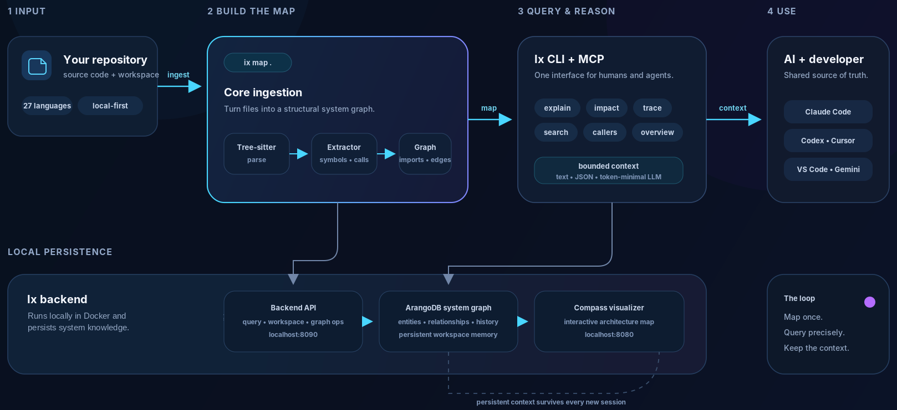

## Mapping

`ix map` parses your repository with [tree-sitter](https://tree-sitter.github.io/), extracts symbols, calls and
imports, and writes them to the graph as nodes and edges: what calls, contains and imports what. The parser covers
[27 languages](/reference/languages/).

Mapping is incremental. Re-running `ix map` refreshes the graph. `ix watch` re-maps on every file change, and the
editor plugins re-ingest a file shortly after you edit it.

## The local backend

The graph is stored in a backend that runs in Docker on your machine:

| Service | Port | Role |
|---|---|---|
| **Ix Memory Layer** | `127.0.0.1:8090` | The HTTP API every client talks to |
| **ArangoDB 3.12** | `127.0.0.1:8529` | The graph database behind it |

Both bind to localhost only, so with the default local backend your code and graph stay on your machine. The backend ships as a released Docker image
(`ghcr.io/ix-infrastructure/ix-memory-layer`). Start it with `ix docker start` and check it with `ix status`.

## Three clients, one graph

| Client | Who uses it | Start it with |
|---|---|---|
| **`ix` CLI** | You, and agents that run shell commands | `ix <command>` |
| **`ix mcp`** | AI clients that speak the Model Context Protocol | `ix mcp install` registers it |
| **Compass** | You, in a browser | `ix view` |

All three share the same [HTTP API](/api/overview/). The graph is the same whichever client reads it: an answer your
agent gets through MCP matches what `ix explain` prints in your terminal.

## Workspaces

Every repository you map is its own **workspace** in the shared backend. Commands run from inside a repository
answer from that repository's graph. `ix view --all` shows every mapped workspace together.

:::caution[`ix reset` affects every workspace]
`ix reset` and `ix reset --code` clear the graph of **every** workspace in the backend, not only the current one.
Re-run `ix map` in each repository afterwards.
:::

## Bounded answers

Query commands return bounded answers. They cap result counts, walk depth and output size, and they report what
they cut:

- `ix depends` and `ix trace` stop at depth 3 and 100 nodes. `truncated=true` means the node cap dropped nodes, and
  `depth_limited=true` means the walk stopped descending.
- `ix read <file>` stops at 400 lines and tells you the range of the next page.
- `ix context` budgets its evidence in tokens (1,500 by default).

Every limit can be raised with a flag. See the [flag reference](/reference/flags/).
